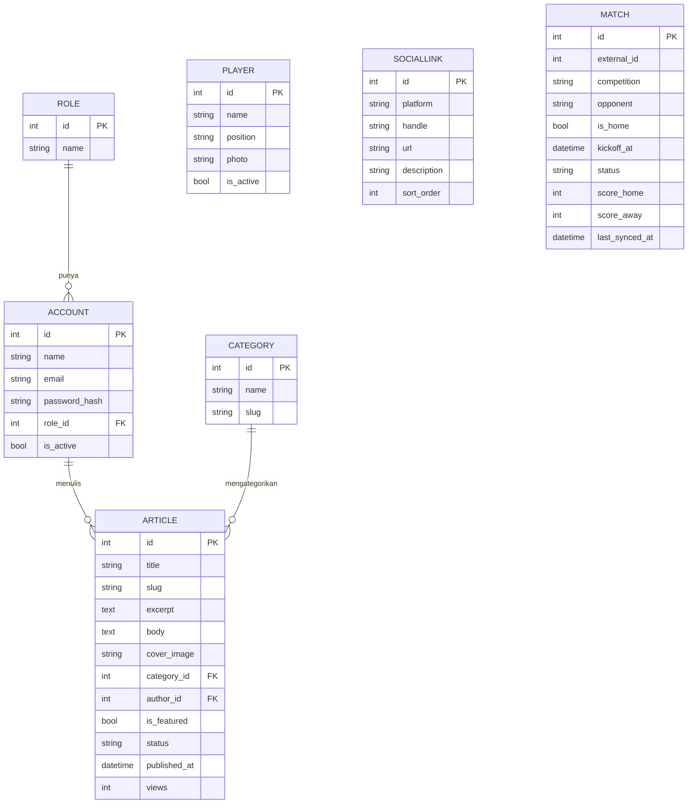

/
Chelind
Chelind
membuat mock up aplikasi untuk website fanspage bola

Terbaru
Membuat file markdown
8 menit yang lalu
Pemahaman rencana project
10 menit yang lalu
Membuat file migrasi Laravel 13
15 jam yang lalu
Analisis kebutuhan ERD untuk landing page Chelind Football
kemarin dulu
Analisis kebutuhan ERD untuk landing page Chelind Football
3 hari yang lalu
Konteks pekerjaan yang fleksibel
4 hari yang lalu
Petunjuk
Tambahkan instruksi untuk menyesuaikan respons Claude

Konteks
1% kapasitas proyek terpakai

Petunjuk 1
282 baris

text

Petunjuk 1
# Chelind Football — Analisis Kebutuhan & ERD
 
Dokumen pegangan hasil analisis desain landing page Chelind Football.
Berisi aktor, pemetaan konten dinamis/statis, ERD final (7 tabel), skema tabel,
integrasi API jadwal, dan catatan semua keputusan yang sudah diambil.
 
---
 
## 1. Aktor / Roles
 
| Role | Akses | Login |
|---|---|---|
| **Master (Owner)** | Akses penuh: kelola semua konten **+** kelola akun & role lain | Ya |
| **Admin** | Kelola konten saja (artikel, pemain, social link) | Ya |
| **User (pengunjung)** | Baca saja | Tidak ada autentikasi |
 
> Catatan penamaan: aktor "User" = pengunjung tanpa login. Secara konsep tabel akun
> disebut "Account", tapi implementasinya **tetap pakai tabel/model `users` bawaan
> Laravel** (bukan rename ke `accounts`) — lihat Log Keputusan §7. Isinya tetap
> hanya Master + Admin (pengunjung tidak punya baris di tabel ini).
 
---
 
## 2. Konten Dinamis vs Statis
 
Prinsip: **isi/data = dinamis** (bisa diubah tanpa developer), **struktur/tampilan = statis**.
 
### Dinamis (dikelola lewat panel admin)
- **Artikel/Berita** — konten utama. Kategori: Berita Tim, Transfer, Komunitas.
- **Pemain** — nama, posisi, foto.
- **Social Link** — platform, handle, URL.
- **Jadwal & hasil pertandingan** — diambil otomatis dari API (bukan input manual).
 
### Statis (butuh developer)
- Layout & styling tiap halaman.
- Label heading section ("Our Social Media", "Jadwal Pertandingan", dll).
- Struktur navigasi & footer, teks copyright.
- Routing antar halaman.
 
---
 
## 3. ERD Final (7 Tabel)
 

 
Relasi hanya ada 3: Role→Account, Account→Article, Category→Article.
`Player`, `SocialLink`, dan `MATCH` berdiri sendiri tanpa foreign key (disengaja, biar simpel).

> Implementasi: `ACCOUNT` di atas = tabel/model `users` bawaan Laravel (bukan tabel
> `accounts` terpisah), dan `MATCH` = model `GameMatch` (nama `Match` tidak valid di
> PHP). Lihat Log Keputusan §7.
 
---
 
## 4. Skema Tabel (detail kolom)
 
### Role
Menyimpan jenis role. Isinya cukup dua baris: master & admin.
- `id` — PK
- `name` — "master" / "admin"
 
### Account
Akun yang bisa login (hanya Master & Admin, bukan pengunjung).
- `id` — PK
- `name`, `email`
- `password_hash` — password terenkripsi
- `role_id` — FK ke Role
- `is_active`
 
### Article
Konten berita. Body menyimpan HTML rich text (paragraf, heading, quote, kotak statistik, dst).
- `id` — PK
- `title`, `slug` (slug otomatis dari judul)
- `excerpt` — ringkasan
- `body` — isi lengkap (HTML)
- `cover_image` — path gambar sampul
- `category_id` — FK ke Category
- `author_id` — FK ke Account (diisi sistem)
- `is_featured` — tandai berita unggulan
- `status` — draft / published
- `published_at`, `views` — diisi sistem
 
### Category
Kategori berita.
- `id` — PK
- `name`, `slug`
 
### Player
Data pemain (dikelola manual). Bendera & nomor punggung menyatu di foto (tanggung jawab editor).
- `id` — PK
- `name`, `position`
- `photo` — path foto
- `is_active`
 
### SocialLink
Link media sosial.
- `id` — PK
- `platform`, `handle`, `url`, `description`
- `sort_order` — urutan tampil
 
### MATCH
Jadwal & hasil pertandingan. Diisi otomatis oleh cron dari API, bukan admin.
- `id` — PK
- `external_id` — id dari API (kunci upsert, hindari duplikat)
- `competition` — "Premier League"
- `opponent` — nama lawan (Chelsea sebagai tim sendiri tidak disimpan)
- `is_home` — kandang / tandang
- `kickoff_at` — waktu laga
- `status` — SCHEDULED / FINISHED
- `score_home`, `score_away` — boleh kosong (belum main)
- `last_synced_at` — terakhir disinkron
 
---
 
## 4b. Daftar Halaman
 
### Halaman Publik (ada di desain Figma)
| # | Halaman | Isi utama | Sumber data |
|---|---|---|---|
| 1 | Homepage | Hero, Social Media, Content Hub, **Jadwal Pertandingan**, berita terbaru | `Article`, `MATCH`, `SocialLink` |
| 2 | News (listing) | Daftar berita + featured + section Pemain | `Article`, `Category`, `Player` |
| 3 | Detail Artikel | Satu artikel penuh (termasuk Match Report + statistik) | `Article` (via slug) |
| 4 | Matchday | Jadwal & hasil + filter kompetisi | `MATCH` (filter `status`) |
| 5 | Transfer News | Daftar berita kategori transfer + filter | `Article` (filter kategori) |
| 6 | Join Community | Halaman CTA | Statis / `SocialLink` |
 
> Halaman 2, 4, 5 pada dasarnya "listing yang difilter" — bisa pakai satu template yang sama.
 
### Halaman Admin (belum ada di Figma, wajib dibangun)
| # | Halaman | Akses |
|---|---|---|
| 7 | Login | Master & Admin |
| 8 | Dashboard / daftar artikel | Master & Admin |
| 9 | Editor artikel | Master & Admin |
| 10 | Kelola pemain | Master & Admin |
| 11 | Kelola social link | Master & Admin |
| 12 | Kelola akun & role | **Master saja** |
 
> Tabel `MATCH` tidak butuh halaman admin — diisi otomatis oleh cron.
 
### Scope Fase 1 (keputusan final)
- **Pakai API dari awal** (bukan tabel manual). Tabel `MATCH` dibuat penuh + cron sync.
- **Homepage menampilkan jadwal** (`status = SCHEDULED`, 2–3 laga terdekat).
- **Halaman Matchday penuh + tampilan hasil/skor**: data sudah tersimpan di `MATCH`,
  tapi view-nya **menyusul** (belum dibuat di fase 1). Ini bukan "di-park" —
  backend siap, tinggal bikin tampilannya kapan pun butuh, tanpa ubah tabel.
 
---
 
## 5. Integrasi API Jadwal (football-data.org)
 
### Endpoint yang dipakai
- `/v4/teams/61/matches` — semua laga Chelsea (id Chelsea = 61).
- `/v4/competitions/PL/standings` — klasemen Premier League (opsional).
 
### Batasan Free Tier (perlu diingat)
- **10 request per menit** (rate limit, bukan kuota bulanan).
- 12 kompetisi termasuk Premier League.
- Data gratis: jadwal, hasil, klasemen, top skor.
- **TIDAK** ada: statistik detail (possession, shots, corner), data squad/pemain,
  lineup, kartu. Ini butuh paket berbayar (Deep Data ~€29/bln).
 
### Pola penyimpanan: cache permanen + sync
Karena rate limit ketat, **jangan panggil API tiap page load**. Sebagai gantinya:
 
1. **Cron** (tiap 15–30 menit) memanggil API lalu **upsert** ke tabel `MATCH`
   (pakai `external_id` sebagai kunci).
2. **Database** menyimpan data permanen (tidak dihapus otomatis).
3. **User** selalu baca dari database — cepat & tidak kena rate limit.
 
Satu baris `MATCH` **berubah seiring waktu**: dari `status = SCHEDULED` (jadwal)
menjadi `status = FINISHED` + skor terisi (hasil). Tidak perlu tabel terpisah.
 
### Cara menampilkan (filter berdasarkan status)
| Bagian web | Query |
|---|---|
| Section "Jadwal Pertandingan" | `status = SCHEDULED`, urut `kickoff_at` naik |
| Halaman "Hasil Pertandingan" | `status = FINISHED`, urut `kickoff_at` turun |
| "Laga berikutnya" di hero | 1 baris `SCHEDULED` terdekat |
 
---
 
## 6. Dashboard Admin (catatan)
 
- Form editor artikel = **cerminan langsung kolom tabel `Article`**
  (judul→title, kategori→category_id, status→status, dst).
- **Match stats** (possession, shots, dll) dimasukkan lewat editor rich text
  (Opsi A): editor mengetik/format sebagai tabel di dalam `body`. Disimpan sebagai
  HTML, bukan tabel/kolom database terpisah.
- HTML-in-body ini **aman** karena hanya role tepercaya (Master/Admin) yang bisa
  menulis, dan editor rich text yang baik otomatis membersihkan (sanitize) HTML.
- Admin & Master pakai form yang sama; Master punya menu tambahan (kelola akun & role)
  yang tidak muncul di sidebar Admin.
 
---
 
## 7. Log Keputusan
 
| Topik | Keputusan | Alasan |
|---|---|---|
| Jadwal pertandingan | Ambil dari API, simpan di tabel `MATCH` | Tidak perlu input manual; selalu update |
| Tabel Team/lawan | Dibuang, cukup kolom `opponent` (string) | Menambah tabel = ribet, tak ada manfaat |
| Foto/bendera/nomor pemain | Menyatu di foto (manual editor) | Sederhana, tak perlu tabel Country/Position |
| Player disinkron API? | Tidak, tetap manual | Squad terkunci paywall + API tak beri foto |
| Match stats | Opsi A — HTML di dalam `body` | Statistik tak tersedia di free tier |
| Tags | Dilewati | Cuma pemanis, tidak difilter |
| Penyimpanan jadwal | Permanen (bukan TTL/auto-delete) | Volume kecil (~600 baris/10 musim); dapat arsip hasil |
| Pakai API dari awal? | Ya — bukan tabel manual | Sekali panggil API sudah dapat jadwal + hasil sekaligus |
| Scope fase 1 Matchday | Homepage tampilkan jadwal; halaman Matchday & tampilan hasil menyusul | Backend siap penuh, view menyusul tanpa ubah tabel |
| Tabel akun: `Account` vs `users` | Tetap tabel/model `users` bawaan Laravel, cukup tambah kolom `role_id` | Project sudah pakai starter kit Fortify + Sanctum yang terikat ke `User`/`users` bawaan (guard, provider, controller login/2FA/reset password sudah jadi); rename ke `accounts` cuma nambah kerjaan reconfigure auth tanpa manfaat, apalagi deadline mepet |
| Nama model tabel `matches` | `GameMatch` (bukan `Match`) | `match` adalah reserved keyword di PHP 8+ (match expression), tidak valid dipakai sebagai nama class |
| Auth: lupa password | Tidak pakai flow email (`Features::resetPasswords()` dimatikan di Fortify) | Cuma 2 akun (Master + Admin), tidak butuh infra kirim email untuk kasus sekecil ini; kalau lupa password, mitigasi cukup command Artisan buat reset langsung di DB |
| Registrasi & 2FA | Tidak diaktifkan di M1 (`Features::registration()`, `twoFactorAuthentication()` tidak di-enable) | Akun Master & Admin dibuat lewat seeder, bukan self-register; 2FA bukan kebutuhan M1 |
| Laravel Fortify | **Dicopot total** (composer remove) beserta seluruh scaffold Inertia+React starter kit bawaannya (`resources/js`, controller/route Settings, dst) | Fortify bawa flow (registrasi, reset password email, 2FA, view Inertia) yang sama sekali tidak relevan untuk 2 akun statis; makan waktu setup/maintenance tanpa manfaat nyata di deadline mepet |
| Auth admin: Sanctum vs native session | **Native session Laravel** (`Auth::attempt()` + middleware `web` ditempel manual ke route di `routes/api.php`), **bukan Sanctum** — deviasi dari asumsi awal di `plan.md` Rev. 3 | Sanctum SPA-mode cuma "session auth biasa" yang dibungkus supaya jalan di `routes/api.php` yang defaultnya stateless; kalau middleware `web` ditempel langsung dari awal, hasilnya identik tanpa nambah package, config, atau tabel `personal_access_tokens`. Sanctum baru relevan kalau nanti FE pisah domain / ada mobile app (§8, tertunda) |
| Frontend: satu repo vs repo terpisah | **Satu repo** — React dikerjakan di `resources/js`/`resources/css` folder Laravel ini, di-build lewat `laravel-vite-plugin` bawaan starter kit (Blade `app.blade.php` + `@vite()`), bukan project/repo Vite terpisah | Sempat salah asumsi "repo terpisah" saat scaffold Inertia dicopot; dikoreksi karena `laravel/wayfinder` + `@laravel/vite-plugin-wayfinder` (generate helper route TS dari route Laravel) cuma masuk akal kalau FE-BE satu repo — tool itu sudah terpasang sejak awal, jadi itu memang niatnya |
 
---
 
## 8. Belum Diputuskan (opsional, untuk nanti)
 
- Apakah `Category` fixed (di-seed) atau bisa ditambah admin lewat panel.
- Site settings (teks hero / banner) — jadi tabel atau hardcode.
- Pilihan CMS/framework konkret (WordPress vs Strapi vs Laravel Filament).
- Perlukah menampilkan statistik pertandingan yang bisa dicari/difilter
  (kalau ya, perlu upgrade ke Opsi B / paket berbayar API).
 
---
 
*Fondasi data model ini disusun berdasarkan analisis desain landing page Chelind Football
dan keterangan 3 aktor (Master, Admin, User).*
